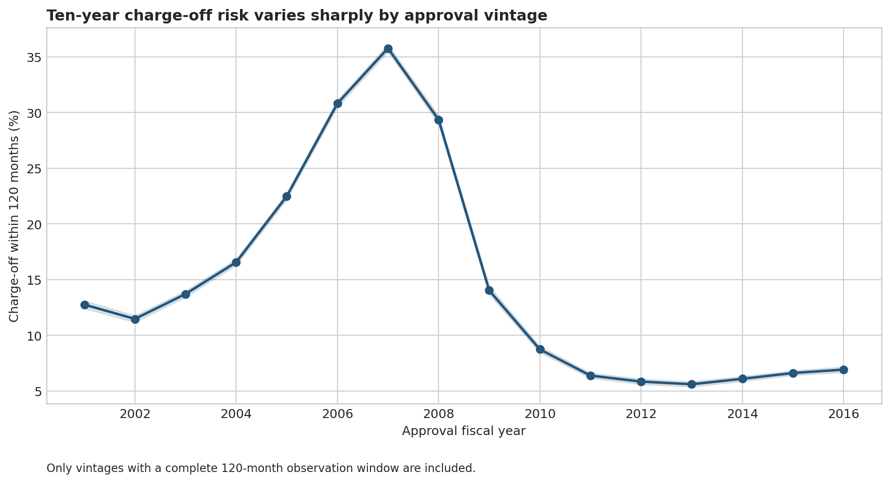
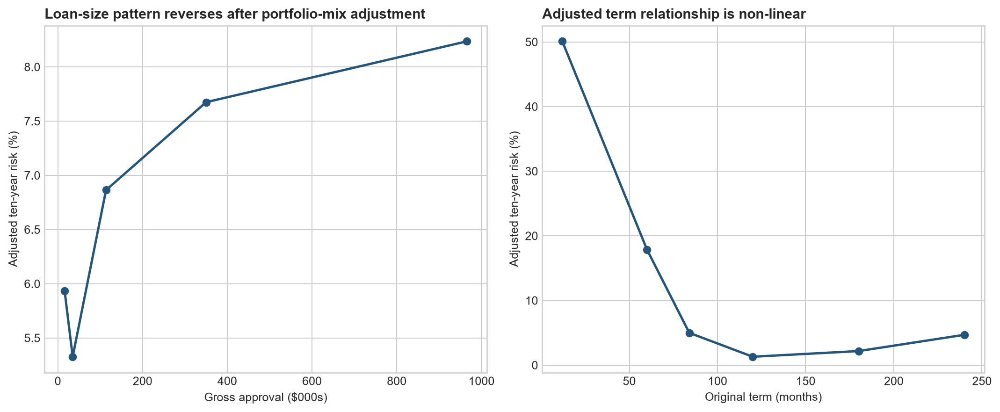
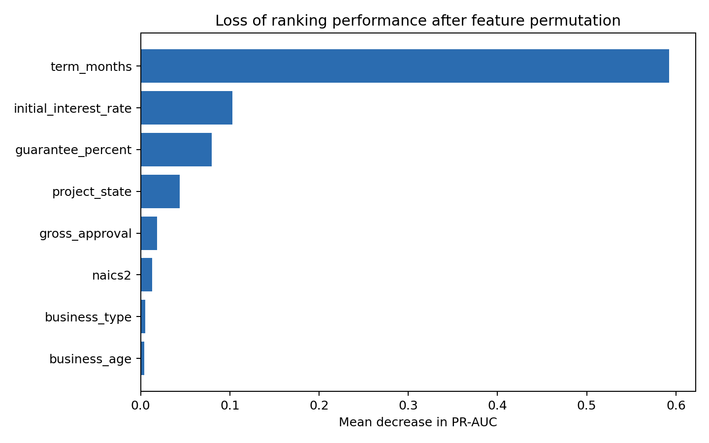
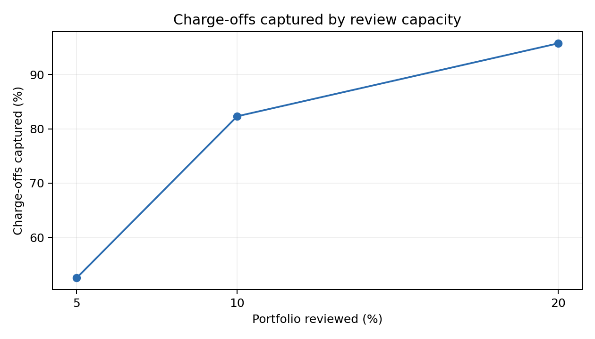

# Small Business Loan Portfolio Risk Analytics

An end-to-end portfolio-risk analysis of the U.S. Small Business Administration (SBA) 7(a) loan programme, combining historical trend analysis, statistical adjustment, machine-learning evaluation, privacy-safe data preparation, and an interactive Tableau story.

**[Explore the interactive Tableau story](https://public.tableau.com/views/SBA7aLoanPortfolioRiskAnalytics/SBA7aLoanPortfolioRiskStory?:language=en-GB&:showVizHome=no)**

> **Project status:** Complete. The Python analysis, statistical modelling, machine-learning evaluation, Tableau-ready datasets, and interactive Tableau Public story are available.

## Project overview

This project examines how SBA 7(a) lending volume, exposure, and long-horizon charge-off risk vary across time, loan size, term, borrower characteristics, industry, and geography. It also evaluates whether a predictive model can support retrospective portfolio monitoring and risk-based review prioritisation.

The source data contains **1,961,455 published loan records from FY1991 through June 2026**. Verified exact repeated records were removed during cohort preparation. Ten-year charge-off outcomes are limited to **FY2001–FY2016**, where a complete 120-month performance window is available.

## Business questions

1. How has SBA 7(a) lending changed over time?
2. Where are charge-off frequency and approved-dollar exposure concentrated?
3. How do borrower, loan, industry, term, and geographic characteristics relate to risk?
4. Which apparent differences remain after statistical adjustment?
5. Can a predictive model rank risk well enough to support portfolio monitoring?
6. How much observed charge-off activity can be captured under limited review capacity?

## Key findings

- Portfolio volume and approved dollars increased substantially over the study period, with notable cyclical disruption.
- Ten-year charge-off rates peaked at **35.78% for FY2007 approvals** and later stabilised at approximately **5.60%–6.92% for FY2011–FY2016**.
- Smaller loans had higher charge-off frequency, while loans above **$1 million represented 51.36% of gross approved dollars**, illustrating the difference between event frequency and dollar exposure.
- Several descriptive gaps narrowed after controlling for approval vintage and available portfolio characteristics, indicating that portfolio mix matters.
- The selected model showed strong rank ordering but understated absolute locked-test risk.
- A small review share captured a large proportion of observed charge-offs, supporting use for retrospective monitoring and review prioritisation—not automated lending decisions.

## Selected analytical findings

### Ten-year risk changed sharply across approval vintages

Crisis-era vintages recorded substantially higher ten-year charge-off rates. This is why the analysis uses time-based validation rather than a random train-test split.



### Risk frequency versus dollar exposure

The loan-size analysis separates two different portfolio questions:

- **Risk frequency:** Which segments have higher charge-off rates?
- **Dollar exposure:** Which segments account for the largest share of approved dollars?

The higher unadjusted risk among smaller loans changed after accounting for vintage and observable portfolio characteristics.

### Statistical adjustment

Observed differences were compared with adjusted estimates that control for approval vintage and available portfolio characteristics. These estimates describe associations and should not be interpreted as causal effects.



## Final model

The selected model was **E06, a HistGradientBoostingClassifier**, trained on FY2010–FY2014 loans and evaluated once on a locked FY2015–FY2016 test set.

The predictors were gross approval amount, original term, SBA guarantee percentage, two-digit NAICS sector, business age, business type, project state, and initial interest rate. Approval vintage was used for temporal splitting and evaluation rather than as a predictor. Borrower and lender identifiers, servicing fields, outcome fields, and post-approval information were excluded.

### Locked-test performance

| Metric | Result |
|---|---:|
| Test loans | 97,439 |
| Observed charge-offs | 6,540 |
| Observed event rate | 6.71% |
| PR AUC | 0.656 |
| ROC AUC | 0.964 |
| Brier score | 0.03335 |
| Mean predicted risk | 5.85% |

The model discriminated well between lower- and higher-risk loans, but its mean predicted probability was below the observed event rate. For this reason, model scores are most appropriate for **ranking, surveillance, and review prioritisation**, not as perfectly calibrated probabilities.

### Feature importance

Permutation importance showed that original term was the dominant model feature, followed by initial interest rate, guarantee percentage, project state, gross approval amount, industry, business type, and business age.



### Monitoring capacity

| Share of portfolio reviewed | Charge-offs captured | Precision | Lift |
|---:|---:|---:|---:|
| 5% | 52.6% | 70.5% | 10.51 |
| 10% | 82.3% | 55.2% | 8.23 |
| 20% | 95.7% | 32.1% | 4.79 |



The 10% scenario illustrates how a portfolio team could assess monitoring capacity; it is not a recommended operational threshold.

## Analytical approach

1. **Source validation:** Verified the four official SBA files against the 42-field data dictionary and recorded file hashes.
2. **Data-quality assessment:** Profiled missingness, dates, categories, numeric anomalies, potential duplicates, and feature timing.
3. **Cohort design:** Constructed a fixed 120-month outcome while accounting for incomplete follow-up and invalid event timing.
4. **Portfolio analysis:** Compared approval volume, vintage risk, segment frequency, and gross-approval exposure.
5. **Statistical analysis:** Estimated adjusted relationships using multivariable logistic regression and marginal standardisation.
6. **Machine learning:** Compared regularised logistic regression with histogram gradient boosting using expanding-window validation.
7. **Locked evaluation:** Assessed ranking, calibration, temporal stability, and monitoring-capacity scenarios on later vintages.
8. **Tableau reporting:** Prepared privacy-safe aggregate sources and built five connected dashboards within an interactive story.

## Interactive Tableau story

The completed Tableau Public story guides viewers through the analysis in five steps:

1. **How the portfolio changed** — approval volume, gross approval amount, and ten-year charge-off trends.
2. **Where risk and exposure concentrate** — loan-size risk frequency, dollar exposure, and term sensitivity.
3. **Geographic portfolio context** — state-level portfolio share, loan volume, and risk measures through an interactive map.
4. **What changes after adjustment** — observed versus adjusted segment risk and adjusted loan-size scenarios.
5. **How the model supports monitoring** — locked-test metrics, calibration by score decile, review-capacity capture, and feature importance.

Viewers can move between story points, hover over marks for detailed tooltips, and interact with the geographic map. State-level results provide portfolio context rather than a risk league table; differences may reflect loan mix, approval vintage, and uneven calibration across states.

**[Open the live Tableau story](https://public.tableau.com/views/SBA7aLoanPortfolioRiskAnalytics/SBA7aLoanPortfolioRiskStory?:language=en-GB&:showVizHome=no)**

## Repository guide

```text
Credit-Risk-Analytics/
├── README.md
├── requirements.txt
├── data/                    # Download instructions; raw data remains local
├── docs/                    # Methodology, findings, and model documentation
├── src/
│   ├── data/                # Source validation and cohort preparation
│   ├── analysis/            # Portfolio and statistical analysis
│   ├── modeling/            # Model training and evaluation
│   └── tableau/             # Tableau aggregate-data preparation
├── reports/
│   ├── figures/             # Selected analytical charts
│   └── tables/              # Selected aggregate results
├── tableau/
│   └── data/                # Privacy-safe aggregate CSV sources
└── config/                  # Frozen model configuration
```

## Data

Source: [U.S. Small Business Administration 7(a) & 504 FOIA dataset](https://data.sba.gov/dataset/7a-504-foia)

This project uses only the four 7(a) CSV files and the 7(a) worksheet from the official data dictionary; the two 504 files are outside scope.

Raw files are not stored in this repository. Although the source is publicly available, the files are large and contain borrower names and addresses that are unnecessary for a public portfolio. Reproduction instructions and expected filenames are provided in `data/README.md`. Tableau outputs are aggregated or otherwise prepared to avoid exposing unnecessary loan-level detail.

## Reproduction

Create and activate a virtual environment, then install the project dependencies:

```bash
python -m venv .venv
```

Activate the environment:

```bash
# macOS/Linux
source .venv/bin/activate

# Windows PowerShell
.venv\Scripts\Activate.ps1
```

Install the dependencies:

```bash
pip install -r requirements.txt
```

After downloading the four official 7(a) files and the data dictionary into `data/raw/`, run the main analysis from the repository root:

```bash
python src/data/verify_schema.py
python src/data/profile_data_quality.py
python src/data/build_cohort.py
python src/analysis/analyze_portfolio.py
python src/analysis/run_statistical_analysis.py
```

Run the modelling workflow in its auditable stages:

```bash
python src/modeling/train_and_evaluate.py audit
python src/modeling/train_and_evaluate.py develop
python src/modeling/train_and_evaluate.py test
python src/modeling/summarize_model_results.py
python src/modeling/run_sensitivity_checks.py
python src/tableau/prepare_tableau_data.py
```

The `develop` and `test` stages refit multiple models and may take considerable time on a local computer. Existing aggregate results are included for review.

## Tools

- Python
- pandas and NumPy
- scikit-learn
- SciPy
- Matplotlib
- Excel
- Tableau Public
- Git and GitHub

## Limitations

- The published data does not include credit scores, borrower financial statements, verified collateral values, or complete underwriting information.
- Complete ten-year follow-up limits the primary outcome population to older approvals.
- The primary FY2010+ analysis contains seven eligible approval vintages.
- The locked test covers FY2015 and only the eligible portion of FY2016.
- FY2026 is partial through June and is not directly comparable with complete fiscal years.
- The selected model underpredicted the locked-test event rate.
- Programme rules, portfolio composition, and category definitions changed over time.
- State improved aggregate model performance, but state-level calibration was uneven.
- Original term may capture product structure and the relationship between contractual term and the fixed outcome horizon.
- The findings describe historical and predictive associations, not causal effects.

## Responsible use

This work supports aggregate portfolio analysis and monitoring research. It does not evaluate individual borrower quality, approval suitability, discrimination, or fair-lending compliance. No borrower-level predictions, names, addresses, exact ZIP-level records, or fitted model binaries are included in the public repository.

It should not be used as an automated lending-decision system or as evidence of causal effects. Any operational use would require governance, fairness assessment, calibration monitoring, documentation, and human oversight.

This project is independent and is not endorsed by the U.S. Small Business Administration.
